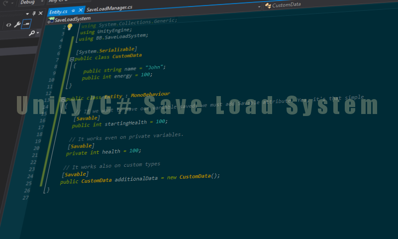

# SaveLoadSystem


# About
When I was creating this tool I was aiming very simple games that needs basic saves system. It propably wont works for big projects where is a lot of data.

# How can I make it works?
1. Copy code to your unity project
2. You have to create SaveLoadManager object somewhere on your scene, this is singleton.
3. Append MonoBehaviours you want to save to your SaveLoadManager.
4. Add "Savable" attribute to variables you want to save.
For example:
```csharp
public class Entity : MonoBehaviour
{
    [Savable]
    public int startingHealth = 100;
}
```
There is also Sanbox folder with some testing stuff. You can check how thinks works here.
5. To save/load we need to call a proper function from our SaveLoadManager
```csharp
// Saving code
BB.SaveLoadSystem.SaveLoadManager.Instance.Save("Saves/Test.save");

// ...

// Loading code
BB.SaveLoadSystem.SaveLoadManager.Instance.Load("Saves/Test.save");
```
5. Profit.

# License
Feel free to use it anywhere you want.
